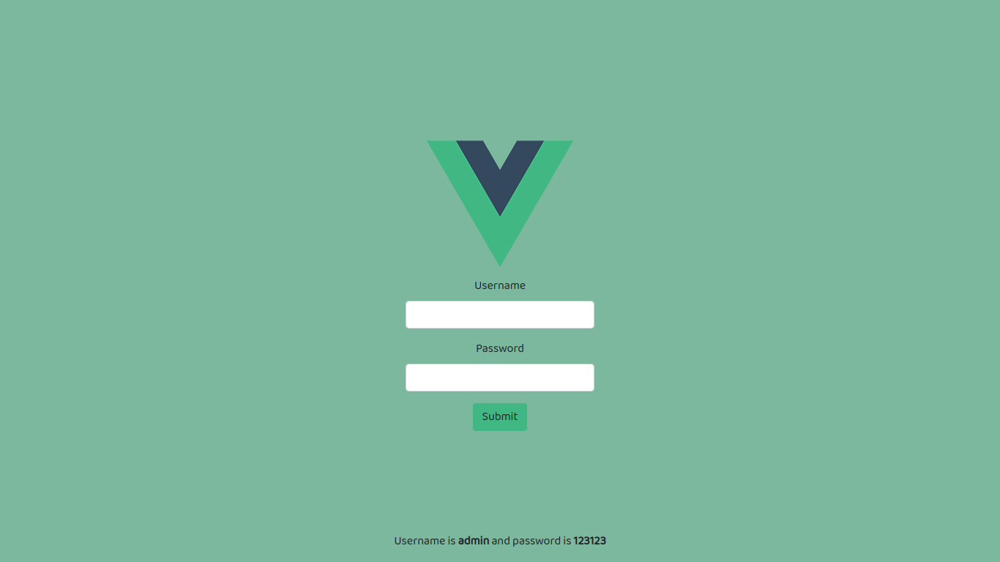

# Example page of login in Vuejs



It's just a example page from zero using Vuex, Vue Router and Vuejs.

## Build Setup

``` bash
# install dependencies
yarn install

# serve with hot reload at localhost:8080
yarn dev

# build for production with minification
yarn build

# build for production and view the bundle analyzer report
yarn build --report
```

## For a detailed explanation

- [Vue.js](https://vuejs.org)
- [Vue Router](https://router.vuejs.org/)
- [Vuex](https://vuex.vuejs.org/)